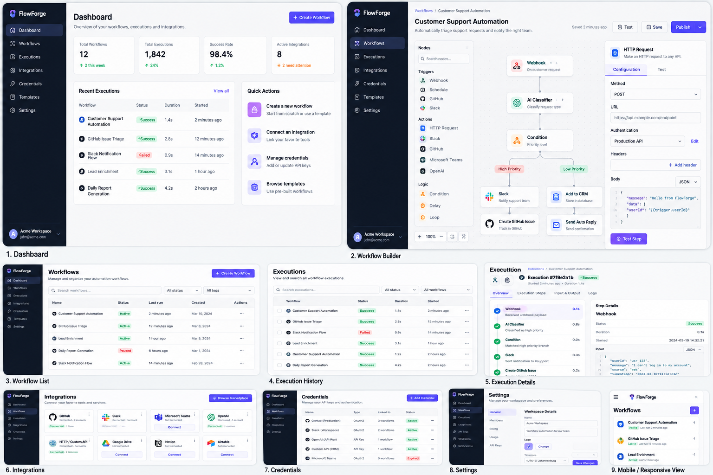

# Design Direction

The mock (`ui-mock.png`, 2026-10-03) sets the **visual style**: dark navy sidebar with the workspace and user at the bottom, white content cards on a light grey canvas, a purple primary action colour, compact tables with status pills, a three-column workflow builder (node palette · canvas · configuration panel), a tabbed execution detail with a step timeline, and a mobile list layout.

**Only screens backed by the real API are built.** Everything else in the mock is an illustration of the style, not a requirement. This table is the scope rule for every part.

| Mock screen | Build it? | What it becomes (part) |
| --- | --- | --- |
| 1. Dashboard | Yes, with real data only | Stat cards from `GET …/dashboard` (runs 24 h / 7 d, success rate) and connections needing attention; recent failures; quick actions limited to *create workflow* and *connect an integration* (Part 09). No "total executions 1,842"-style numbers the API does not provide; no week-over-week deltas |
| 2. Workflow builder | Yes | Palette from `GET /node-types` (real types only: manual trigger, GitHub issue opened, condition, log, Slack message, Microsoft To Do task, AI summarize/classify/extract), canvas with true/false branches, config panel per node, Save / Publish (Parts 05–07). Schedule, HTTP request, generic webhook, HTTP poll, Jira and Gmail nodes are added by Parts 17–22 (backend Parts 23–26). Still no Delay, Loop, Teams or OpenAI nodes; no "Test step" (the backend has no single-step test — a manual run of the published workflow is the test) |
| 3. Workflow list | Yes | Status `Draft / Published / Archived` (not "Active/Paused"), search by name only if the API supports it, no tags (Part 04) |
| 4. Execution history | Yes ("Runs") | Filters: status, workflow, trigger source, dates (Part 08) |
| 5. Execution details | Yes | Overview + steps timeline with per-step input/output; "Logs" tab omitted (step data and error descriptions cover it) (Part 08) |
| 6. Integrations | Partly | GitHub, Slack, Microsoft (Part 10); Jira, Gmail and HTTP connections (Parts 18, 21, 22), from `GET /integrations/providers`. No marketplace, OpenAI card, Google Drive, Notion or Airtable |
| 7. Credentials | **No** | Credentials are part of a connection and never shown; the Integrations page covers it |
| 8. Settings | Partly | Workspace name, members, account, danger zone (Part 11). No billing, usage, API keys, logo, timezone settings |
| 9. Mobile / responsive | Yes | Responsive lists and navigation (Part 12); the editor is desktop/tablet first |
| Sidebar items | Adjusted | Dashboard, Workflows, Runs, Integrations, Settings. No Credentials or Templates |

## Tokens (replacing the scaffold's ink/ember palette)

| Token | Use | Value (from the mock) |
| --- | --- | --- |
| `sidebar` | Navigation background | `#0F1629` (navy) |
| `primary` | Primary buttons, active nav item, links | `#4F46E5`–`#5B4CF5` (indigo/purple) |
| `canvas` | Page background | `#F5F6FA` |
| `surface` | Cards, panels | `#FFFFFF` |
| `line` | Borders, dividers | `#E4E7EC` |
| `muted` | Secondary text | `#667085` |
| Status | Success / Failed / Running / Queued / Cancelled / Warning | green / red / blue / grey / grey / amber pills, always with a text label |

Exact values are set once in `src/styles/index.css` (`@theme`) when the shell is restyled (Part 03 introduces the workspace switcher in the sidebar; Part 12 audits contrast — primary on white must stay ≥ 4.5:1).

## Logo and wordmark (2026-10-03)

Chosen by the product owner: a stylised **"F" of two flowing bands** — purple→blue on top, blue→cyan below — next to the wordmark **Flow** (solid: ink on white, white on navy) **Forge** (blue→violet gradient; lighter sky→violet stops on navy for contrast), with the tagline **"Automate what matters"** in spaced capitals.

- Implemented as inline SVG in `src/components/brand/logo.tsx` (`LogoMark`, `Logo` with `tone` and `tagline`) and `public/favicon.svg` — vector, so it is sharp at every size; the name is real text for screen readers.
- Used in the sidebar (mark + wordmark), on the login/register brand panel (with tagline) and above the form on small screens; page title "FlowForge — Automate what matters".
- The original artwork should be added as `design/logo.png` for reference (the image shared in chat was not saved to disk).
